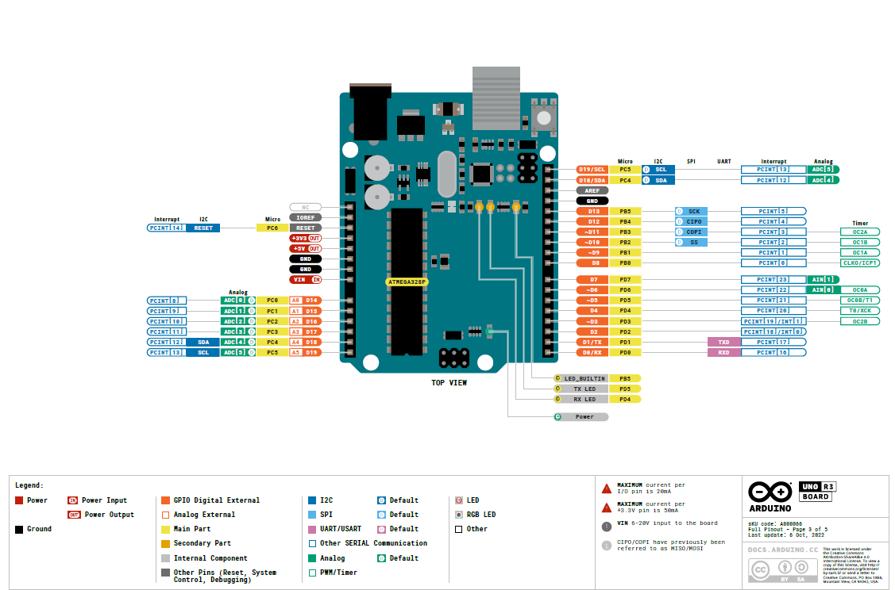

# 🧭 Microcontrollers and Peripherals Learning Roadmap
Hello! This covers the necessary topics to learn how to effectively use a microcontroller. Please note that all the code given in the below roadmap is written with Arduino UNO in mind.

- 🌐 [Microcontroller Basics](https://www.geeksforgeeks.org/microcontroller-and-its-types/)
- 🌐 [More in depth basics](https://embedded.fm/blog/2016/2/27/embedded-software-engineering-101-microcontroller-basics)
- 📺 [Video basics](https://youtu.be/JwCTkm43CxQ?si=0tUonzVJ_JYL_ayb)

If you want to skip everything and step right into coding with Arduino, here you go:
  - 📺 [Learn to Code with Arduino](https://youtu.be/BLrHTHUjPuw?si=poh2x0MUSpIbeLGe)

Here's a simulator which you might find useful while learning the coming topics:
- [Wokwi](wokwi.com)
- [Tinkercad](tinkercad.com)

---

## Hardware
This is a collection of resources to fully understand appreciate how an Arduino is built!

Let's start off by seeing what an Arduino consists of:
- [Understanding Hardware](https://www.allaboutcircuits.com/technical-articles/understanding-arduino-uno-hardware-design/)
- [Overview of Components](https://docs.arduino.cc/tutorials/uno-rev3/intro-to-board/)

Now what are peripherals and how do we connect them to an Arduino?
- 🌐 [Peripherals(GPIO)](https://www.renesas.com/en/support/engineer-school/mcu-programming-peripherals-01-gpio?srsltid=AfmBOook9IGdlzMRN3uEcLX7hU-N4Dqs3dF8YJS9AGzY_uVE5iT2rgJh)
- 🌐 [Interfacing Peripherals](https://www.maven-silicon.com/blog/interfacing-peripherals-with-microcontrollers-a-hands-on-guide/)
- 🌐 [Microcontroller peripherals](https://embeddedinventor.com/9-essential-microcontroller-peripherals-explained/)
- 🌐 [Course on embedded systems](https://embedded.fm/blog/ese101)
- 📺 [Detailed Video on GPIOs](https://youtu.be/Naz_qLfcWpg?si=o9IsMjnijAiqaLiN)

---

## Communication
- 🌐 [Protocols](https://medium.com/geekculture/microcontroller-connection-protocols-w1-i2c-spi-uart-7625ad013e60)
- 📖 [More in depth about Communication Protocols](./resources/Communication_Protocols.pdf)
- 🌐 [UART Example](https://docs.arduino.cc/micropython/communication/uart/)
- 🌐 [UART Everything](https://deepbluembedded.com/arduino-uart-example-tutorial/)
- 🌐 [I2c, UART, SPI](https://www.parlezvoustech.com/en/comparaison-protocoles-communication-i2c-spi-uart/)

---

## MPU6050 IMU
- [Usage](https://randomnerdtutorials.com/esp32-mpu-6050-accelerometer-gyroscope-arduino/)
  
- [Examples](https://electronoobs.com/eng_arduino_tut76.php)

---

## Data Storage
- [EEPROM](https://docs.arduino.cc/learn/built-in-libraries/eeprom/)
- [EEPROM Examples](https://docs.arduino.cc/learn/programming/eeprom-guide/)
- [Flash Memory explained](https://www.youtube.com/watch?v=r2KaVfSH884)
- 
---

## Cores & Threads
- [Stuff](https://www.namehero.com/blog/cpu-cores-vs-threads-everything-you-need-to-know/)
- [Multi Core](https://www.techtarget.com/searchdatacenter/definition/multi-core-processor)
- [Multi Thread](https://www.geeksforgeeks.org/multithreading-in-operating-system/)

---

## RTOS
- [Info](https://www.geeksforgeeks.org/real-time-operating-system-rtos/)

---
Here is the Arduino Uno Pin digram with ample labelling to suit all your needs:

