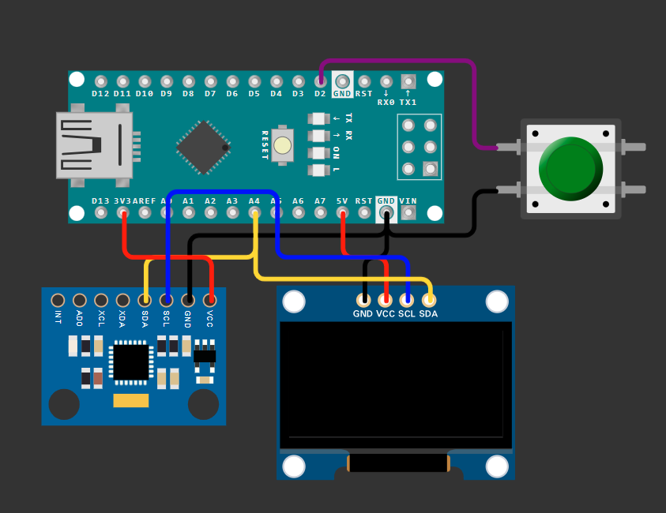

# Arduino Project

## Why this?
Well, it's a space shooter game, who doesn't like it? We felt that it was simnple enough to put together while also being complicated enough to induce learning. It is also very fun to play. Inspired by the space shooter - Galaga - this is made to have fun and learn a whole lot along the way.

## Circuit Diagram

## Simulation

https://github.com/user-attachments/assets/4c447f56-73f2-4516-90e0-8ddece679c89

